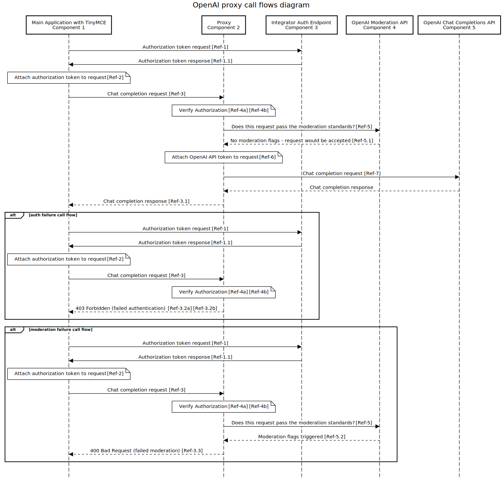

# Ai Proxy reference docs

## Overview

This is a reference implementation showing developers how to integrate their TinyMCE application with the TinyMCE [plugin name].  This is not a production ready application and is to be used for demonstration and training purposes only.

Its recommended you review the OpenAi Proxy call flows diagram as it provides a high level overview of the interactions between the required components that enables the OpenAi suggestions feature.  The documentation will describe in more detail how to implement these interactions as a reference towards configuring your own solution.

## Main **Application with TinyMCE [Figure 1.0]**

The reference application is a simple nodejs server which serves a single page “Message of the Day” application. 

The NodeJS server has 6 endpoints:

- [`GET /`](../example-app/index.js#L52) - serves the application page.
- [`GET /ai-request.js`](../example-app/index.js#L53) - serves the ChatGPT shim.
- [`GET /authenticated`](../example-app/index.js#L56) - returns 200 for a logged in user and 403 for a logged out (unauthenticated) user.
- [`GET /message`](../example-app/index.js#L59) - serves the current message of the day.
- [`POST /message`](../example-app/index.js#L71) - updates the current message of the day.
- [`POST /login`](../example-app/index.js#L87) - authenticates a username/password and creates a session cookie so the users is logged-in.
- [`POST /logout`](../example-app/index.js#L104) - invalidates the session cookie so the user is logged-out

The application has 2 states: 

- Logged out - where the message of the day is displayed but can’t be edited, and
- Logged in - where a TinyMCE editor holds the current message of the day and can be used to edit it. While logged-in it is possible to use the AI plugin to query Chat GPT 3.5.

### ChatGPT shim

The AI plugin is agnostic to the AI provider allowing you to adapt different AI backends however to do that the integrator has to provide some code to adapt to the provider API. In the case of this example we are using ChatGPT 3.5.

In that code snippet we connect to ChatGPT via the envoy proxy running on [localhost](http://localhost) port 8080.

It is worth noting that we do not need to provide an API key for ChatGPT because that will be added by the envoy proxy.

## **Proxy [Figure 2.0]**

Envoy is used to proxy the requests after they are filtered by the Open Policy Agent (OPA).

This makes use of the container images [envoyproxy/envoy](https://hub.docker.com/r/envoyproxy/envoy) and [openpolicyagent/opa](https://hub.docker.com/r/openpolicyagent/opa) from Docker Hub.

These both use configuration files in the `/config/` folder with [`envoy.yaml`](../config/envoy.yaml) configuring the Envoy proxy and [`opa.yaml`](../config/opa.yaml) configuring the Open Policy Agent.

The Open Policy Agent also makes use of the Rego files to script the process of authenticating and moderating the requests to be sent to OpenAI.

### envoy.yaml
The [`envoy.yaml`](../config/envoy.yaml) file is heavily commented but here is an overview.

- Lines 1 to 5: Sets the port where the admin page is hosted. The admin page is useful
for debugging problems but it is strongly recommended that it not be made accessible
remotely as it makes available serveral destructive operations.
- Lines 8 to 16: Configures the proxy server to listen to connection requests on
port 8080. This is repeated for both IPv4 and IPv6 so that it will listen to 
connection attempts from both.
- Lines 28 to 29: Says that the proxy is not serving as multiple hosts but rather treats all incomming as to a single host.
- Lines 31 to 35: Tells the proxy to send everything that passes the filters and
that goes to the path /v1/ to the OpenAI cluster (defined later) on behalf of the client.
- Lines 37 to 50: Tells the proxy how to add CORS headers though it won't
actually do the addition of the headers until the related filter.
- Lines 52 to 62: Filters out requests to the health check "/ping" and handles 
it without passing the request onwards.
- Lines 63 to 72: Stores the path of the request in a lookup for a later filter.
- Lines 73 to 75: Adds the CORS headers using the previously defined rules (Lines 37 to 50).
- Lines 76 to 97: Runs the Open Policy Agent when the path matches /v1/ and filters
the requests based on running the rego scripts which are specified in opa.yaml.
- Lines 98 to 100: Runs the HTTP router which is required.
- Lines 102 to 115: Tells the proxy to define the OpenAI cluster as all IP addresses
returned by a DNS lookup on api.openai.com which should be contacted in a round-robin
fashion. It also specifies that the list of IP addresses should be regularly queried
to ensure changes are reflected.
- Lines 117 to 129: Tells the proxy to use TLS when contacting api.openai.com.

## **Integrator Auth Endpoint [Figure 3.0]**

The nodejs server provides a `/authenticated` endpoint which can be used to check if the caller is logged in. This is called by 

…. As this is an example application, this authentication component has been simplified to illustrate the allow and reject states, your final production configuration will need to be tailored to suit your applications production authentication requirements.

## OpenAI Moderation API **[Figure 4.0]**

## **OpenAI Chat Completions API [Figure 5.0]**

## The flow Diagram

https://sequencediagram.org/